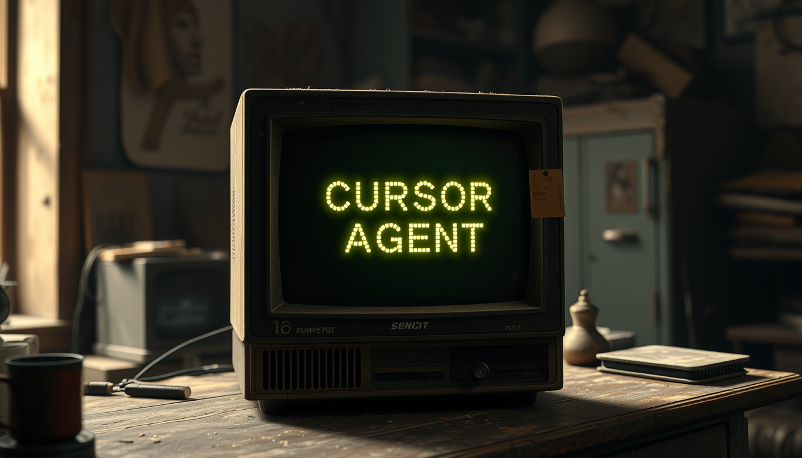
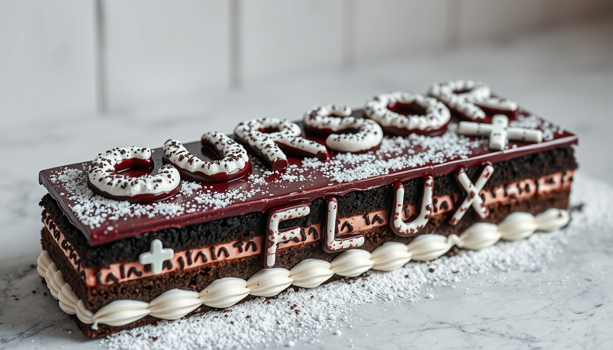

# Cursor Task Runner

This repo contains an example task runner script that you can use with Cursor.



**IMPORTANT: This is non standard use of cursor and may not work. It only works in the new Composer mode as it needs to be able to write multiple files!**

For now its just setup to create images, but it could be extended to create other types of content.

Cursor does not support text to image generation, but with this task runner it can.

## Prerequisites

Before you begin, ensure you have the following:

- Python installed on your system
- An API token from Replicate (NOT FREE)
- The necessary Python packages (`replicate`, `requests`, `colorama`)
- Replicate API token in your env as `REPLICATE_API_TOKEN`

## Process

1. Setup & run the task runner
2. Update your cursor rules 
3. Create the image task file
4. Prompt cursor to create an image

## 1. Set up the Task Runner

The task runner script (`task_runner.py`) monitors a `TODO.md` file for image generation tasks. 

Run it in a terminal in cursor.

When a new task is added, the script will automatically generate the image using the Flux model from Replicate, and save it to the specified filename.

## 2. Update your cursor rules

This will take a bit of trial and error, but with the right rules, cursor will add a TODO each time it wants to create an image.

[Here are the rules I used](.cursorrules)


## 3. Create the image task file

Create a new file in the `tasks/image` directory that contains the instructions for image creation.


I originally used the same prompt format as Claude here:

```
<task: {task_name}>
{task instructions}
</task>
```

But it seemed plain text rules worked better.

You can see the file [here](tasks/image)

The key is to not give it an extension so you can easily `@image` summon it in your cursor chat.

## 4. Prompt cursor to create an image

Just ask cursor but make sure you use @image and press enter to select the task file.

> Please create an @image of a black forest gateau cake spelling out the words "CURSOR 💜 FLUX", tasty, food photography, dynamic shot 4:5



It will even work when you ask cursor to create an article

> Please create an markdown article about my love of cursor, cake and fluxthat includes at least 3 @image.

[Here is the article in markdown](examples/article/cursor-cake-flux.md)

Or even create a landing page

> Please create a landing page for a new product called "Cursor Loves Flux" - make sure you create suitable @image for the page thats all about the love of flux, cursor and cake!

[The landing page](examples/webpage/index.html)

## Wheres the code?

Glad you ask - [here it is](https://github.com/1mrat/cursor-taskrunner).


Happy creating!