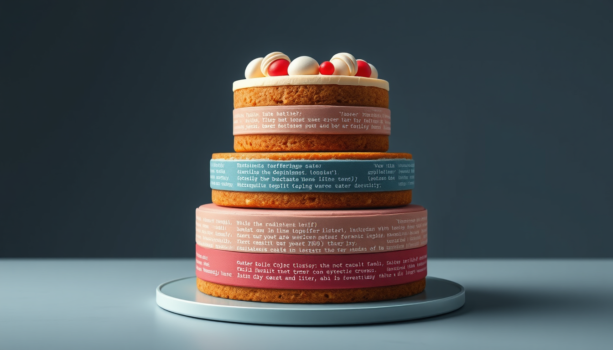
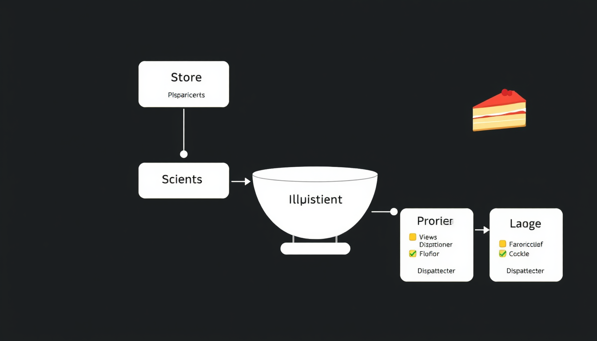

# My Love for Cursor, Cake, and Flux

As a developer and dessert enthusiast, I've found an unexpected harmony between my passion for coding, my love for cake, and my fascination with the Flux architecture. Let me take you on a journey through these seemingly unrelated topics and show you how they blend together in my world.

## Cursor: The Developer's Best Friend

Ok. I will create this image: cursor_coding.png in 16:9

Every programmer knows the importance of a good text editor, and for me, Cursor has become an indispensable tool in my coding arsenal. Its intuitive interface and powerful features make writing code a breeze, almost as satisfying as taking that first bite of a perfectly frosted cake.

Cursor's AI-powered suggestions and code completion feel like having a skilled pastry chef by your side, offering just the right ingredients to make your code shine. It's not just a text editor; it's a coding companion that understands the recipe of great software development.

## Cake: A Sweet Metaphor for Code

Ok. I will create this image: layered_cake_code.png in 1:1

Speaking of recipes, let's talk about cake. A well-structured codebase is much like a layered cake – each layer serves a purpose, and when combined, they create something greater than the sum of their parts.

Just as a cake needs the right balance of flavors and textures, good code requires a balance of functionality, readability, and maintainability. And much like the joy of sharing a delicious cake with friends, there's a special satisfaction in collaborating on a well-crafted piece of software.

## Flux: The Cherry on Top

Ok. I will create this image: flux_diagram_cake.png in 16:9

Now, let's add Flux to this mix. Flux is an application architecture that, like the perfect frosting, brings everything together. It provides a unidirectional data flow that makes state management in complex applications as smooth as spreading buttercream on a cake.

Flux's store, actions, and dispatchers work together like the key components of a cake recipe. The store is your base, holding the state of your application. Actions are like the flavoring agents, initiating changes. Dispatchers ensure that these changes are applied consistently, much like ensuring even distribution of ingredients in your batter.

## Bringing It All Together

In my world, Cursor helps me write the code, the concept of a well-structured cake inspires my application architecture, and Flux provides the framework to make it all work seamlessly. It's a unique blend of technology and culinary inspiration that makes my development process both efficient and enjoyable.

So the next time you're debugging with Cursor, remember the layered complexity of a good cake. And when you're implementing Flux in your application, think of it as adding that final, delicious touch to your coding confection. Happy coding and happy baking!
